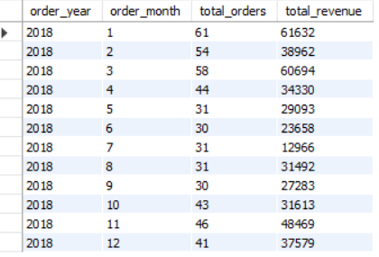
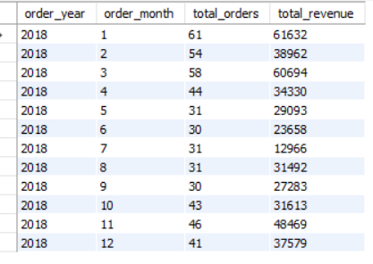
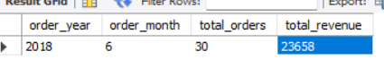

# task_6
Sales Trend Analysis Using Aggregations

# 📊 Sales Trend Analysis Using SQL Aggregations

## 💡 Objective:
The aim of this task was to analyze monthly sales trends, compute total order volumes, total revenue, and derive meaningful insights from the **online_sales** dataset using SQL aggregation techniques.

---

## 🧰 Tools Used:
- MySQL Workbench
- MySQL  
- `online_sales` Dataset (`orders` and `details` tables)

---

## 📚 Dataset Overview:

| Table Name | Key Columns                                                      |
|------------|------------------------------------------------------------------|
| orders     | `Order ID`, `Order Date`, `CustomerName`, `State`, `City`        |
| details    | `Order ID`, `Amount`, `Profit`, `Quantity`, `Category`, `Sub-Category`, `PaymentMode` |

---

## 💡 Analysis Queries & Descriptions:
### Joining the two tablesdata


### -- Filter by Specific Date Range



### Average Order Value Result


### Top 5 Revenue Months Result


### Secific Date Result



### 1️⃣ **Initial Table Exploration**
```sql
SELECT * FROM online_sales.details;
SELECT * FROM orders;
DESCRIBE orders;

